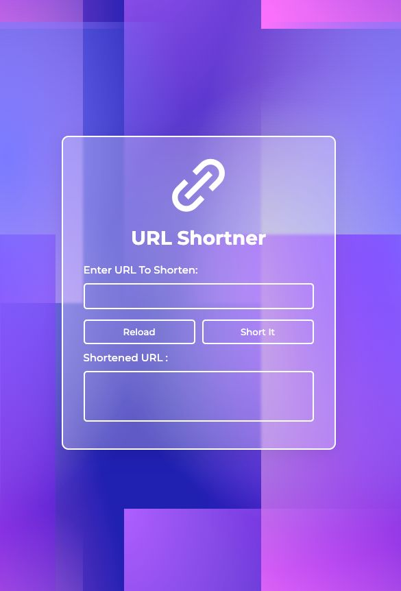

# Day #59

### Url Shortner
In this project developed with JavaScript and used TinyURL's API for shortens a long web address. It creates a link in the form of letters and numbers that look nothing like the original.

# Screenshot
Here we have project screenshot :

