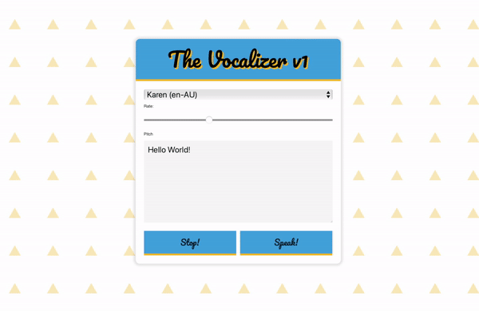

# Day #68 - Vocalizer V1 - Hovered Speech To Text App

## Description

The Vocalizer v1 is a web-based speech synthesis application. Users can choose from different voices, speeds, and pitch options to listen to texts spoken aloud. This application utilizes the `SpeechSynthesis` API provided by modern web browsers.

## Installation

To run this project locally, follow these steps:

1. Clone this repo:
2. Go to the cloned directory:
3. Open `index.html` in your preferred web browser.

## Usage

To use the application:

1. Select a voice.
2. Adjust the Rate and Pitch settings.
3. Write the text you want to be spoken in the text area.
4. Press the "Speak" button to listen to the text aloud. Use the "Stop" button to stop the speech.

## Contributing

Those who wish to contribute can send pull requests or open issues to solve existing problems.