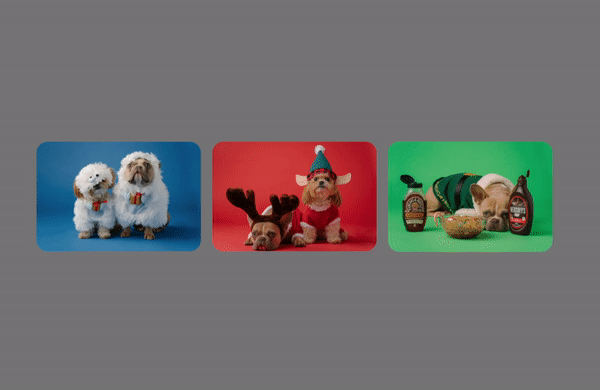

# Day #69 - Special X-Mas Responsive Cards 

## Description

This project showcases a set of responsive cards designed with a Christmas theme. Each card features an engaging holiday image with overlaying text that provides a brief description and a call-to-action button.

## Features

- Responsive design that adjusts to various screen sizes
- Smooth CSS animations for an interactive user experience
- Modern and festive design perfect for the holiday season

## Technologies Used

- HTML
- CSS
- Google Fonts

## Installation

To run this project locally, follow these steps:

1. Clone this repo:
2. Go to the cloned directory:
3. Open `index.html` in your preferred web browser.

## Usage

The cards are designed to be interactive. Hover over a card to see the description and the 'Read More' button. The cards are best viewed on a full-screen desktop browser or a mobile device in portrait mode.