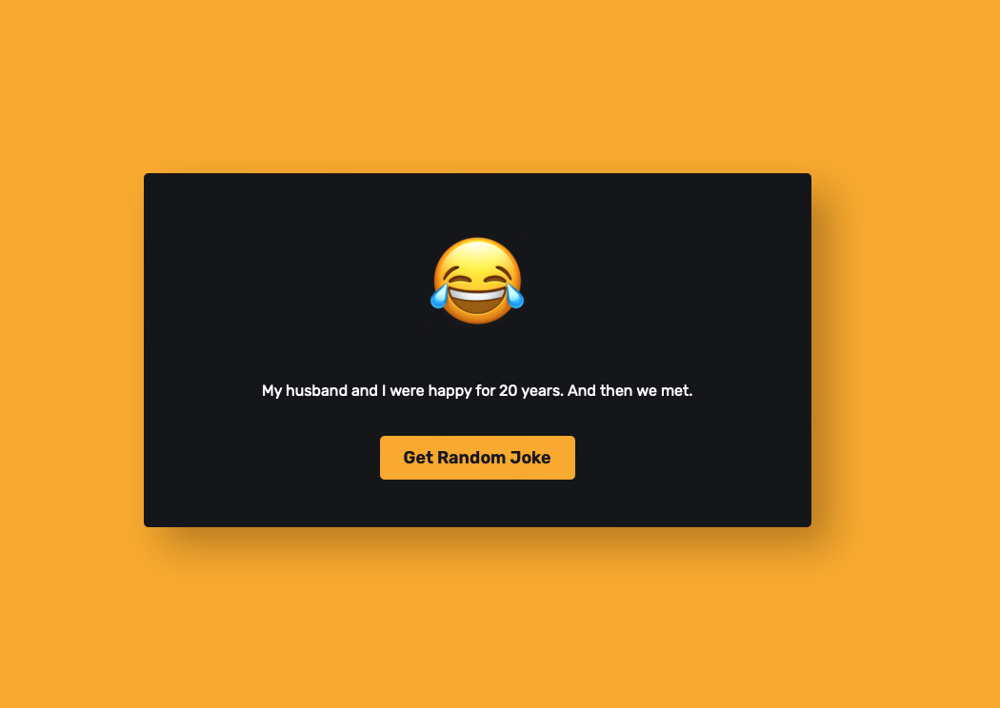

# Day #72 - Random Joke Generator

## How It Works

The application runs in a web browser and is built using HTML, CSS, and JavaScript. Here are the basic steps of how it works:

1. Users open the web page.
2. The page contains a "Get Random Joke" button.
3. Users click the button.
4. JavaScript fetches a random joke text from an API.
5. The joke text is displayed on the page with transition effects (e.g., fading out the previous joke text, fading in the new joke text).

## Technologies Used

This application utilizes the following technologies:

- Joke API (Example: [Random Joke API](https://sv443.net/jokeapi/v2/))
- HTML
- CSS
- JavaScript

## How to Use

To use the application, follow these steps:

1. Clone this repository or download it as a ZIP file.
2. Open the `index.html` file in the root directory of the application in a web browser.
3. Click the "Get Random Joke" button to retrieve a random joke.
