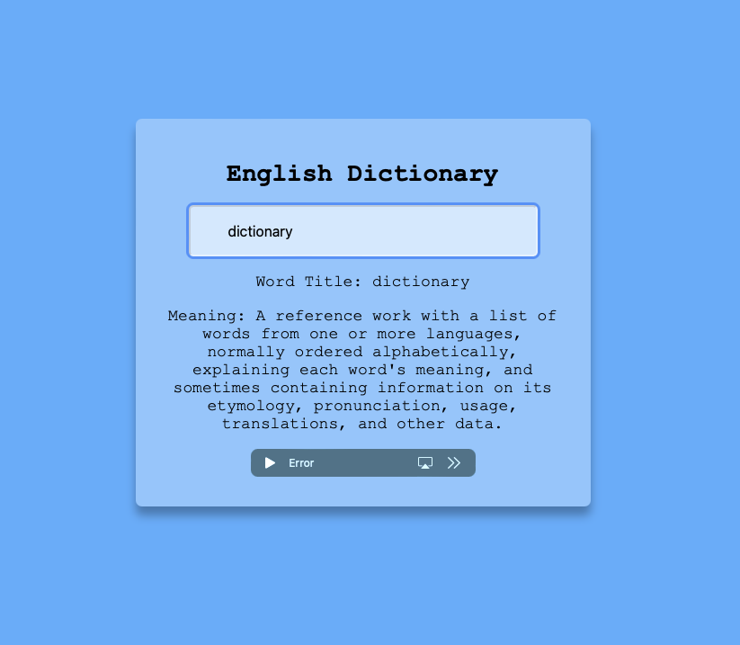

# Day #73 - English Dictionary

## How It Works

The application runs in a web browser and is built using HTML, CSS, and JavaScript.

## Technologies Used

This application utilizes the following technologies:

- Dictionary API (Example: [Dictionary API](https://api.dictionaryapi.dev))
- HTML
- CSS
- JavaScript

## How to Use

To use the application, follow these steps:

1. Clone this repository or download it as a ZIP file.
2. Open the `index.html` file in the root directory of the application in a web browser.
