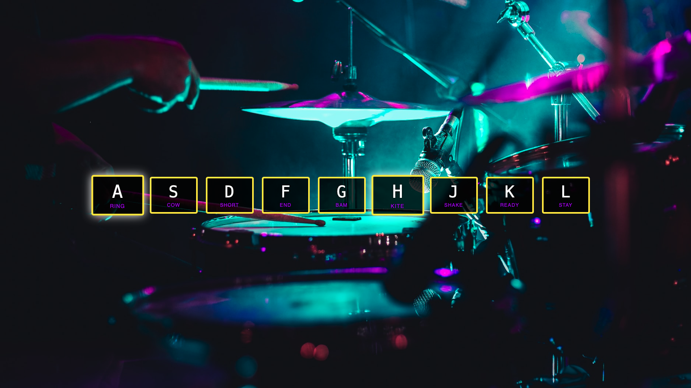

# Day #74 - Drum Kit

## How It Works

The application runs in a web browser and is built using HTML, CSS, and JavaScript. It is an interactive drum kit that plays sounds when specific keys on the keyboard are pressed. Each key is associated with a different drum sound, creating an engaging and fun experience for users who want to practice their drumming skills or just have some fun making music.

## Technologies Used

This application utilizes the following technologies:

- HTML: For the structure of the drum kit interface.
- CSS: For styling the application and making it visually appealing.
- JavaScript: To add interactivity to the drum kit, allowing users to play sounds by pressing keys.

## How to Use

To use the application, follow these steps:

1. Clone this repository or download it as a ZIP file.
2. Open the `index.html` file in the root directory of the application in a web browser.
3. Press any of the displayed keys (A, S, D, F, G, H, J, K, L) on your keyboard to play the corresponding drum sound.

Enjoy making beats with your own virtual drum kit!
