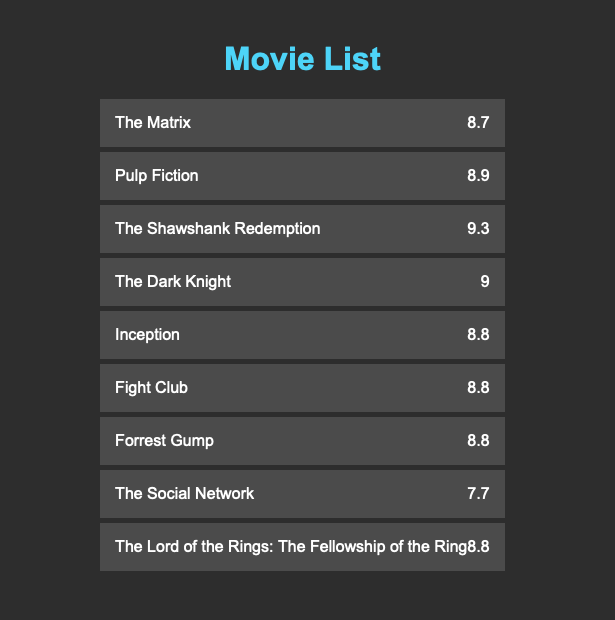

# Day #75 - Draggable Movie List

## Project Overview

The Draggable Movie List is an interactive web application built using HTML, CSS, and Vue.js. It allows users to manage and customize their movie lists by dragging and dropping movie cards to rearrange their order.

## How It Works

The application provides a list of movies displayed as draggable cards. Users can reorder the movies by dragging and dropping the cards. Each movie card includes details such as the movie title and rating.

## Technologies Used

This project utilizes the following technologies:

- HTML: For the structure of the movie list interface.
- CSS: For styling the application and providing a visually appealing design.
- Vue.js: To add reactivity and manage the dynamic behavior of the movie list.

## How to Use

To use the application, follow these steps:

1. Clone this repository or download it as a ZIP file.
2. Open the `index.html` file in the root directory of the application in a web browser.
3. Drag and drop movie cards to rearrange their order based on your preference.

Enjoy organizing your movie list with this draggable movie list application!

## Acknowledgements

This project was inspired by the need for an intuitive and user-friendly way to manage and customize movie lists.