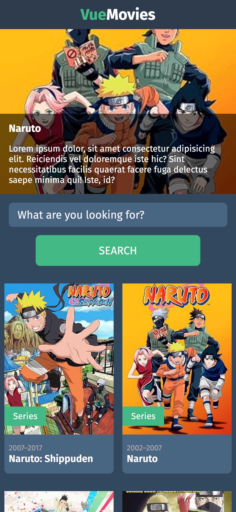
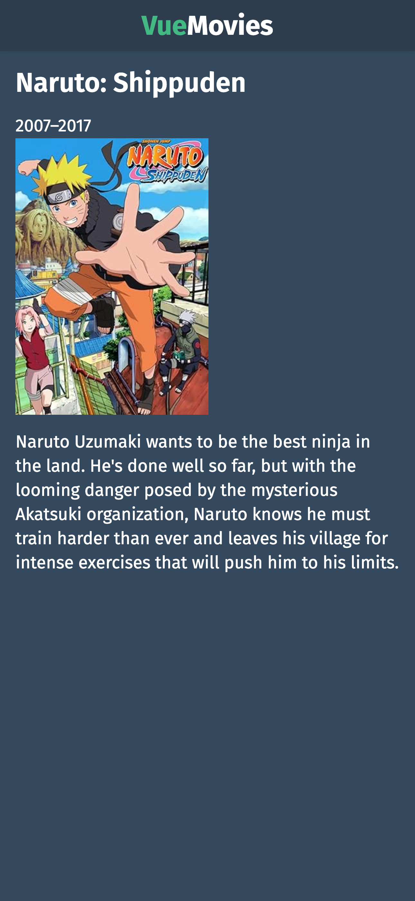

# Day #77 - Movie App with VUE





## Project Overview

This project is a simple movie application developed using Vue.js. Users can search for movies, and upon clicking on a movie, they can view more details about it.

## How It Works

1. HOMEPAGE
- On the homepage, users will find a search box to search for movies.
- Type a movie name into the search box and press ENTER.
- Results will be fetched using the OMDB API and displayed to the user.
- Users can click on any movie to navigate to the detail page.

2. DETAIL PAGE
- On the detail page, users can view more information about the selected movie.
- Details such as movie title, year, cast, director, etc., will be listed on the detail page.

## Technologies Used

This project utilizes the following technologies:

- Vue.js
- OMDB API

## Project setup
```
yarn install
```

### Compiles and hot-reloads for development
```
yarn serve
```

### Compiles and minifies for production
```
yarn build
```

### Lints and fixes files
```
yarn lint
```

### Customize configuration
See [Configuration Reference](https://cli.vuejs.org/config/).
