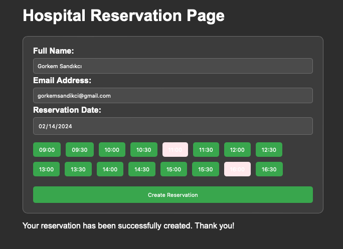

# Day #78 - Hospital Reservation System

## Project Overview

This project is a simple hospital reservation system where users can book appointments for medical services.

## How It Works

- Users enter their personal information (name and email), select the desired date for the appointment, and choose an available time slot.
- Available time slots are displayed based on the selected date and are dynamically updated to reflect the reserved times.
- Once the user submits the form, their reservation is created, and the selected time slot's button changes color to indicate it's been reserved

## Technologies Used

- Vue.js: Frontend framework for building reactive web interfaces.
- HTML/CSS: Basic web technologies for structuring and styling the user interface.
- JavaScript: Programming language used for dynamic interactions and data manipulation

## How to Use

1. Clone this repository to your local machine.
2. Open the index.html file in your web browser.
3. Fill out the form with your name, email, desired appointment date, and select an available time slot.
4. Click the "Create Reservation" button to submit your appointment request.

Enjoy organizing your movie list with this draggable movie list application!

## Acknowledgements

- This project was created as part of the daily coding challenge series.
- Special thanks to Vue.js for providing a simple and efficient way to build interactive web applications.