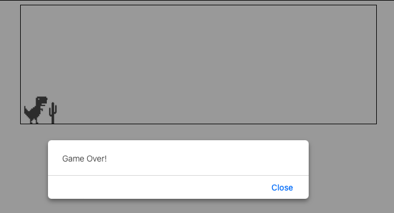

# Day #79 - Dino Run Game Clone

## Project Overview

This project is a clone of the Chrome dinosaur game that appears when the internet connection is lost. It is implemented using HTML, JavaScript, and CSS.

## How It Works

- The game starts automatically when the webpage is opened.
- The player controls a dinosaur character that automatically runs forward.
- The player can make the dinosaur jump to avoid obstacles (cacti) by pressing the space bar.

## Technologies Used

- HTML: Markup language for structuring the webpage.
- CSS: Styling language used to design the appearance of the game.
- JavaScript: Programming language used to implement the game logic and interactions.

## How to Use

1. Clone this repository to your local machine.
2. Open the index.html file in your web browser.
3. You can press the space bar to start playing the dinosaur game.

## Acknowledgements

- This project was inspired by the dinosaur game that appears in Google Chrome when there is no internet connection.
- Special thanks to the creators of the original game for the inspiration.