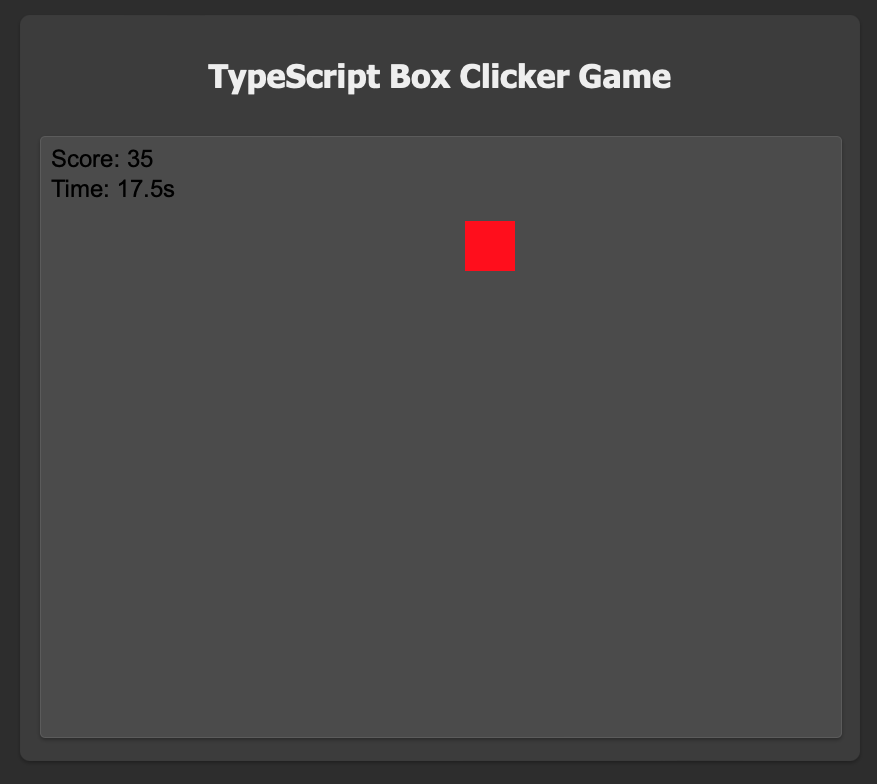
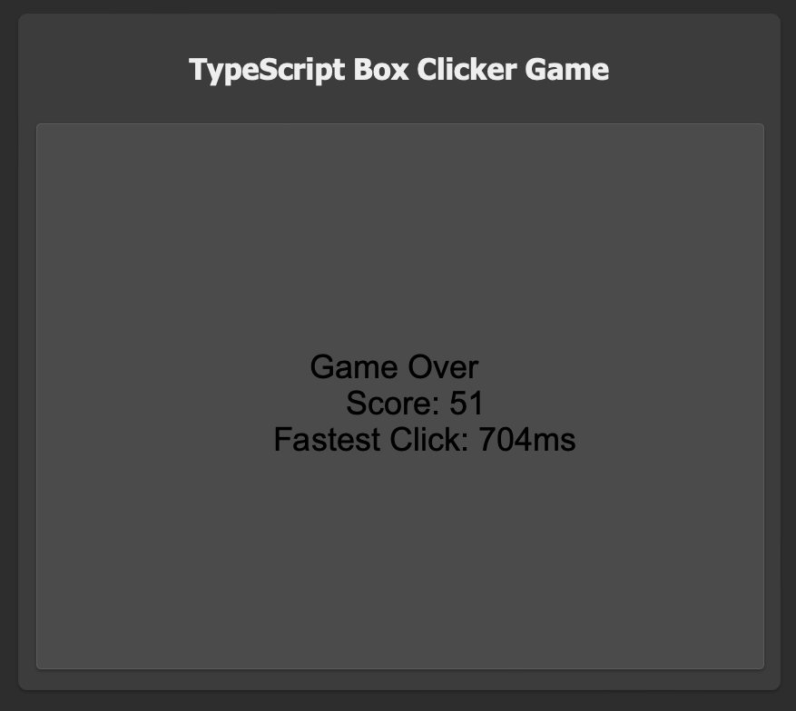

# Day #79 - Dino Run Game Clone

## Project Overview

This project is a simple box clicking game that runs in the browser. The game involves clicking on randomly placed boxes to score points. TypeScript is the programming language used at the core of the game.

## How It Works

- The game starts automatically and presents the user with randomly placed boxes to click on.
- When the user clicks on a box, they earn a point, and the box is placed in a new location.
- The game lasts for 1 minute, and the user can see their fastest click time and total score.

## Technologies Used

- TypeScript: The programming language used at the core of the game.
- HTML and CSS: Used to create the game's layout and user interface.

## How to Use

1. Clone this repository to your local machine.
2. Open the index.html file in a web browser.
3. Click on the boxes to play the game.

## Acknowledgements

- This project was created to learn basic game development with TypeScript.