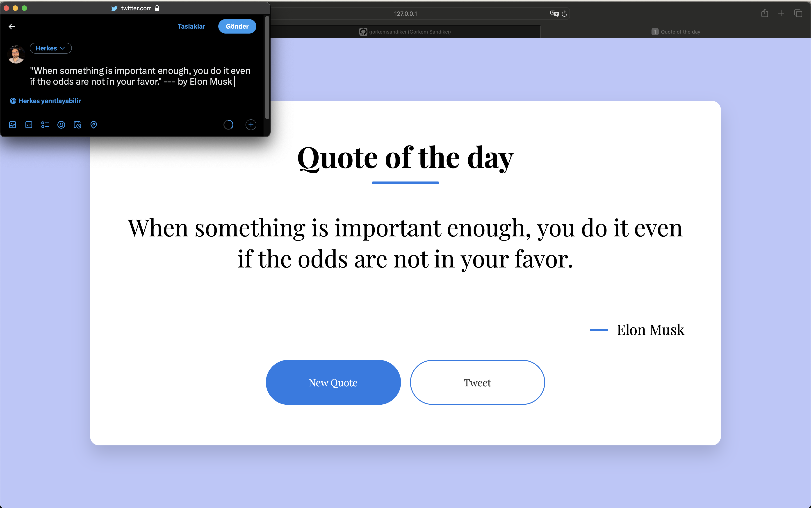

# Day #81 - Quote of the Day

## Project Overview

This project is a simple web application that displays a random quote of the day. Users can click a button to get a new quote or tweet the current quote.

## How It Works

- The application fetches a random quote from the [Quotable API](https://api.quotable.io/random) and displays it.
- Users can click the "New Quote" button to get a new random quote.
- Users can click the "Tweet" button to share the current quote on Twitter.

## Technologies Used

- HTML: Used to create the structure of the web page.
- CSS: Used to style the web page.
- JavaScript: Used to fetch quotes from the API and handle user interactions.

## How to Use

1. Clone this repository to your local machine.
2. Open the index.html file in a web browser.
3. Click the "New Quote" button to get a new quote.
4. Click the "Tweet" button to share the current quote on Twitter.

## Acknowledgements

- This project uses the [Quotable API](https://api.quotable.io/) to fetch random quotes.