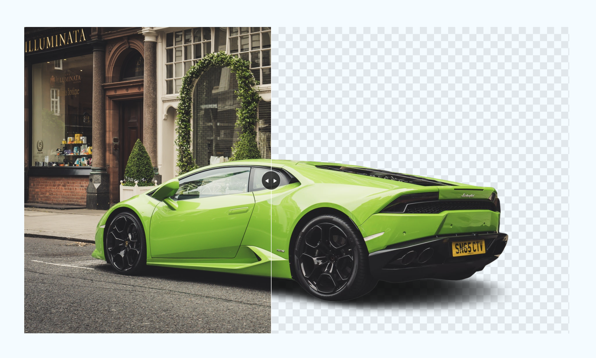

# Day #82 - Background Change Effect

## Project Overview

This project demonstrates a simple background change effect using JavaScript. When the user hovers over the image, the background color changes dynamically.

## How It Works

- The project uses a container div (container) to hold the content.
- Inside the container, there is a div (imb-box) that contains an image and a line (span) with an arrow (arrow).
- The JavaScript code calculates the width of the image wrapper (img-wrap) based on the mouse position relative to the imb-box and updates its width accordingly.
- The line (span) is positioned to follow the width of the image wrapper, creating a visual effect of revealing the image.

## Technologies Used

- HTML
- CSS
- JavaScript

## How to Use

1. Clone this repository to your local machine.
2. Open the index.html file in a web browser.