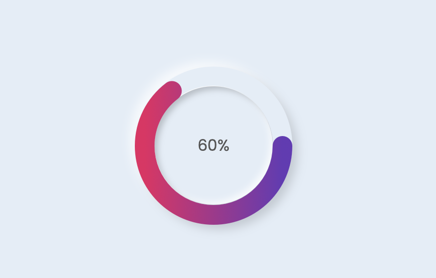

# Day #83 - Neomorphism Progress Bar



## Project Overview
This project aims to create a neomorphism-style progress bar using HTML, CSS, and JavaScript.

## How It Works
1. Open the index.html file.
2. View the project page by opening the index.html file in your browser.
3. The progress bar slowly fills up to 100%.


## Technologies Used

- HTML
- CSS
- JavaScript

## How to Use
Development Environment Setup
1. Clone this repository:
```sh
git clone https://github.com/username/neomorphism-progress-bar.git
```
2. Navigate to the project directory:
```sh
cd neomorphism-progress-bar
```
3. View the project by opening the index.html file in your browser.