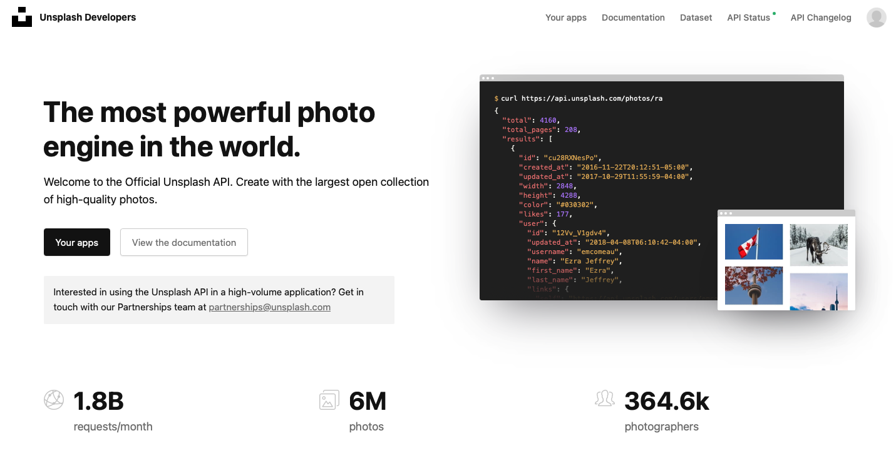
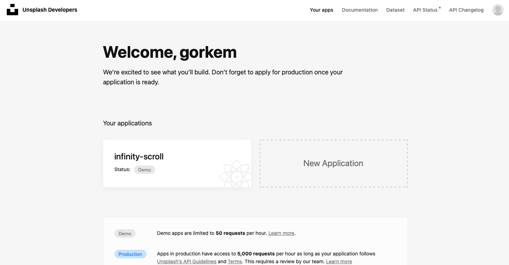
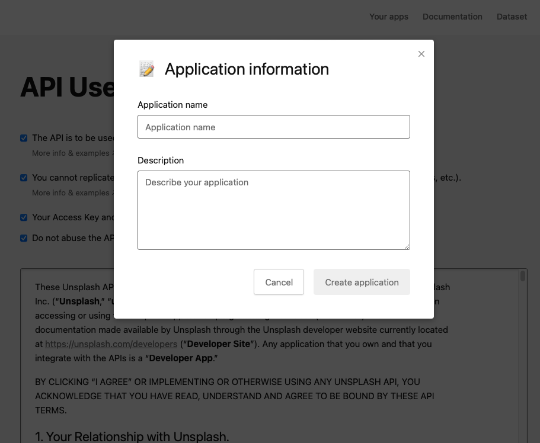
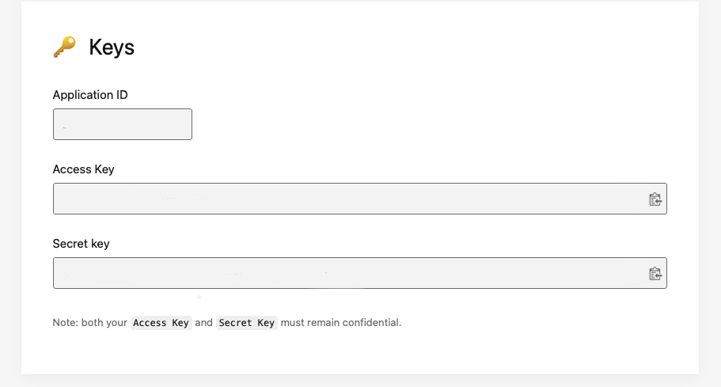

# Day #85 - Infinity Scroll

## Project Overview
This project continuously loads new images into view when scrolling.

## How It Works

- Create an account on [Unsplash](https://unsplash.com/developers)

- Create an app from the dashboard, click on Your apps to create one.
- To get your API_KEY, click the New Application button
- Give your application a name and description. When you're done, click on Create application

- Access you key. To be used in calling your endpoint

## Technologies Used

- HTML
- CSS
- JavaScript
- [Unsplash API](https://unsplash.com/developers)

## Contributing

If you would like to contribute, please open a pull request. For major changes, please open an issue first to discuss the changes.