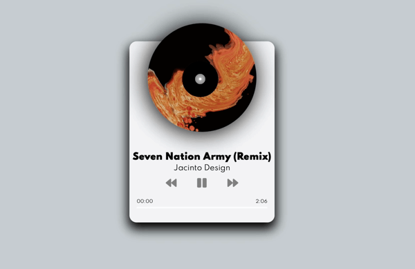

# Day #86 - Music Player

## Project Overview

A web music player based on the HTML5 audio element.

## Technologies Used

- HTML
- CSS
- JavaScript

## How to Use

1. Clone this repository to your local machine.
2. Open the index.html file in a web browser.