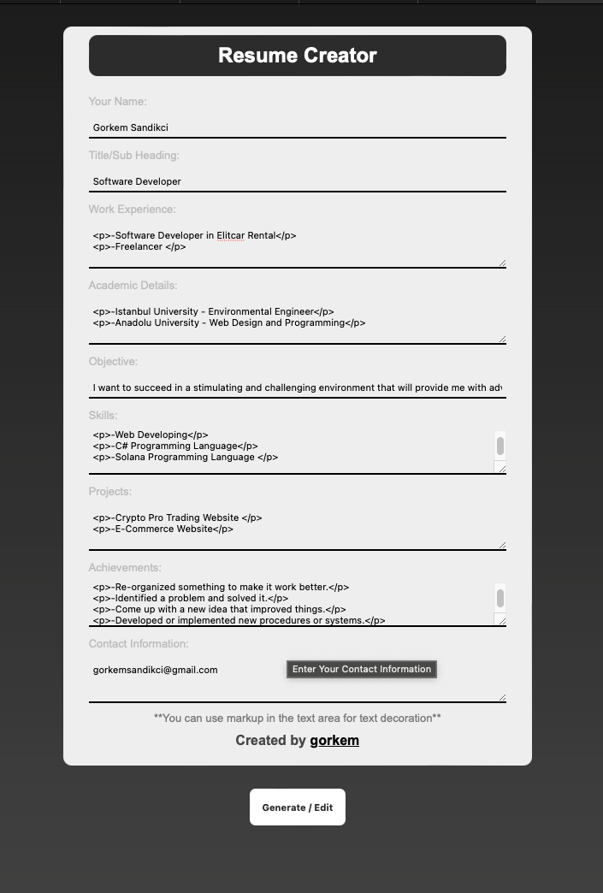
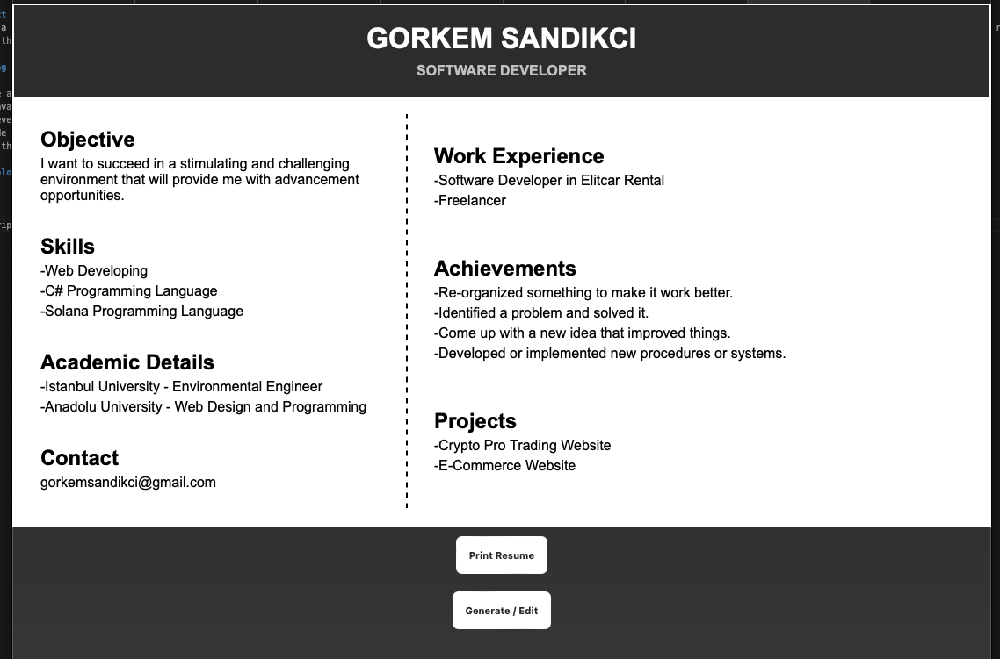

# Day #88 - Dynamic Resume Creator

## Project Overview
Creating a well-designed and professional resume can be a challenging and time-consuming task for job seekers. Many individuals struggle with formatting, organizing information, and ensuring their resume stands out among others. To address this problem, a Resume Creator project was developed to simplify the resume-building process and provide users with a user-friendly interface to generate effective resumes effortlessly.

## Getting Started

1. Create an HTML form with input fields for resume information.
2. Use JavaScript to toggle between the input form and resume preview.
3. Retrieve user input from the form and dynamically populate the preview.
4. Include a button for printing the resume.
5. Style the elements using CSS for the desired layout and design.

## Technologies Used

- HTML
- CSS
- JavaScript