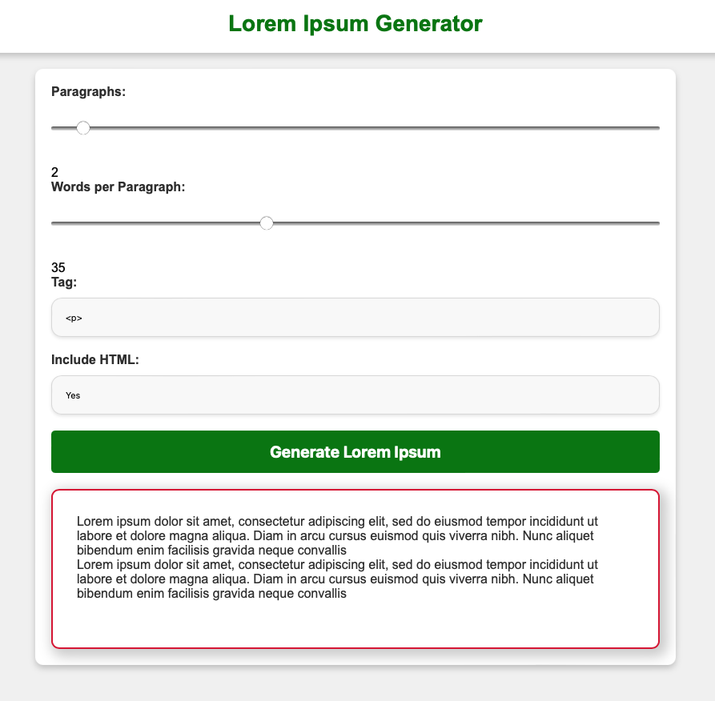

# Day #89 - Lorem Ipsum Generator

## Project Overview
In this project, we are going to implement a Lorem Ipsum Generator Application through HTML, CSS, and JavaScript. Lorem Ipsum, a placeholder text commonly utilized in the printing and typesetting industry, serves to visually represent a document’s layout instead of relying on meaningful content.

## Getting Started

In this approach, we use various methods and functions to achieve the desired functionalities, as described below:

1. HTML Structure: Define the structure of the web application using HTML, creating elements for paragraphs, sliders, dropdowns, and buttons.
2. JavaScript for Interactivity: Employ JavaScript to add interactivity to the application. Handle user input, update displayed values, and generate Lorem Ipsum text.
3. Specific JavaScript Functions: Use specific JavaScript functions to perform tasks such as real-time slider value updates, random word generation, and applying HTML tags.
4. Dynamic Dropdown Population: To dynamically populate the HTML tag selection dropdown, create <option> elements using a JavaScript function based on an array of tag options.
5. Event Listeners: Add event listeners to input elements (e.g., sliders, dropdowns) and the generate button to detect user interactions.

## Technologies Used

- HTML
- CSS
- JavaScript