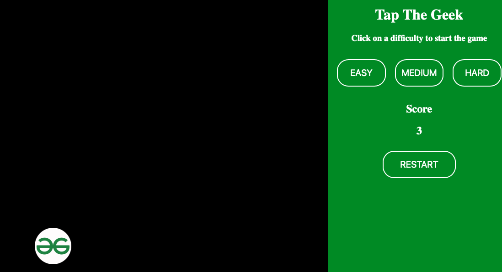

# Day #90 - Tap the Geek

## Project Overview
Tap-the-Geek is a simple game, in which the player has to tap the moving GeeksForGeeks logo as many times as possible to increase their score. It has three levels easy, medium, and hard. The speed of the circle will be increased from level easy to hard. I bet, it is very difficult for the players to get a single score in the Hard level.

## Technologies Used

- HTML
- CSS
- JavaScript