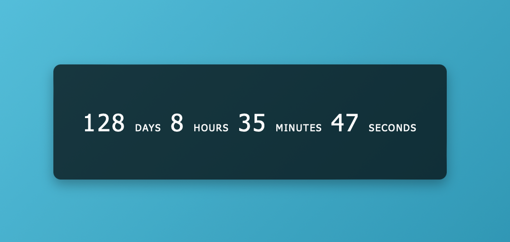

# Day #92 - Countdown Timer

## Project Overview
This is a simple countdown timer created using HTML, CSS, and JavaScript.

## Features

- Set a specific end date and time for the countdown.
- The timer displays the remaining days, hours, minutes, and seconds.

## How to Use

1. Clone the repository to your local machine.
2. Open the index.html file in your web browser.
3. Set the end date and time for the countdown in the script.js file.
4. The timer will start automatically and display the remaining time.

## Technologies Used
- HTML
- CSS
- JavaScript