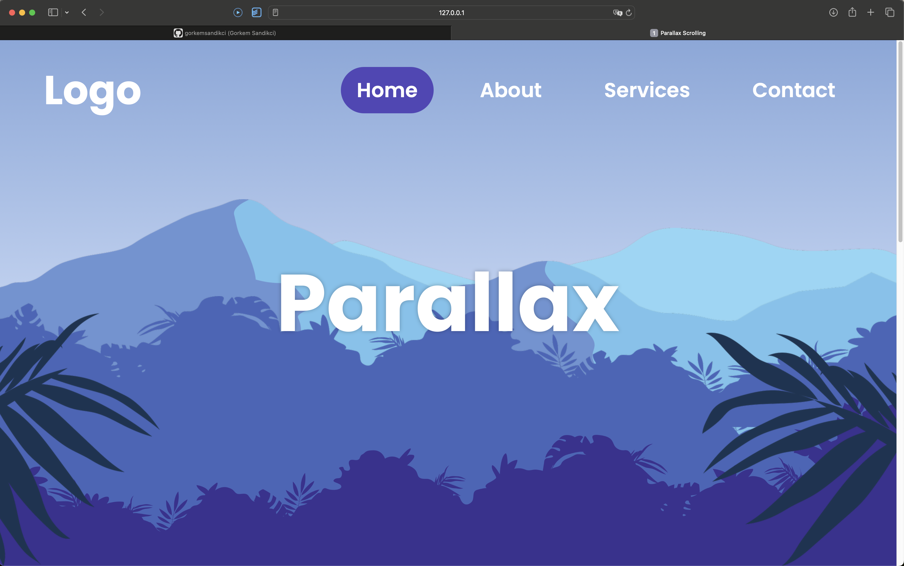

# Day #93 - Parallax Scrolling Effect

## Project Overview
This project contains an example website created using the parallax scrolling effect.

## Features

- Parallax scrolling effect implemented using JavaScript.
- Responsive design for mobile and desktop browsers.
- Smooth scrolling animations.

## How to Use

1. Clone the repository to your local machine.
2. Open the index.html file in a web browser.

## Technologies Used
- HTML
- CSS
- JavaScript