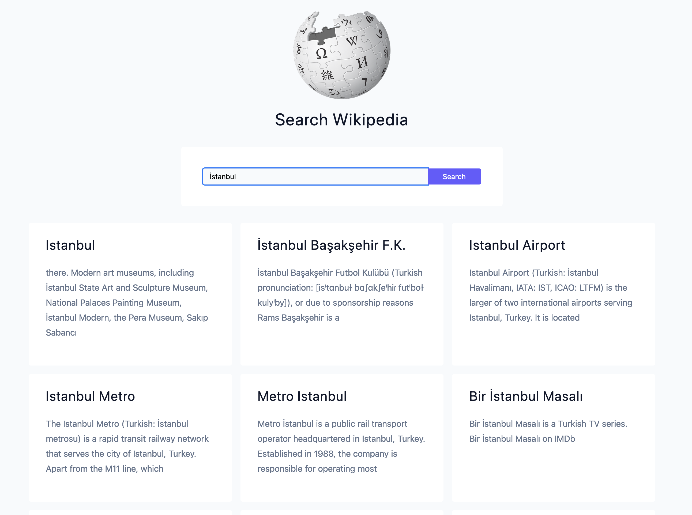

# Day #94 - Wikipedia Clone

## Project Overview

This project aims to create a platform similar to Wikipedia. Our project is open source and community-driven, meaning it aims to provide an environment where anyone can contribute. The project runs on [operating system, language, etc.].

## Features

- **User-friendly Interface:** Our platform offers a user-friendly interface, making it easy for users to navigate and contribute.
- **Search Functionality:** Users can easily search for articles using keywords, helping them find relevant information quickly.
- **Mobile Responsiveness:** The platform is responsive and works well on mobile devices, allowing users to contribute on the go.

## Technologies Used
- HTML
- CSS
- JavaScript