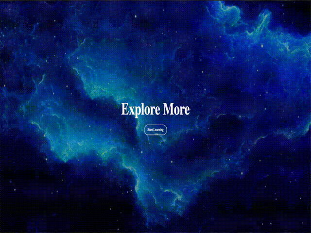

# Day #95 - Website with Video Background

This project is a simple website template with a video background, created using HTML and CSS.

## Preview

## Features

- **Video Background:** The website features a video background that adds a dynamic element to the design.
- **Responsive Design:** The website is designed to be responsive and works well on different screen sizes.
- **Customizable:** The template can be easily customized to fit different themes or branding.
- **Easy to Use:** The code is well-organized and easy to understand, making it easy for developers to modify and extend.

## How to Use

To use this template, simply download or clone the repository and open the `index.html` file in your web browser.

## Contributing

If you'd like to contribute to this project, feel free to fork the repository and submit a pull request.

