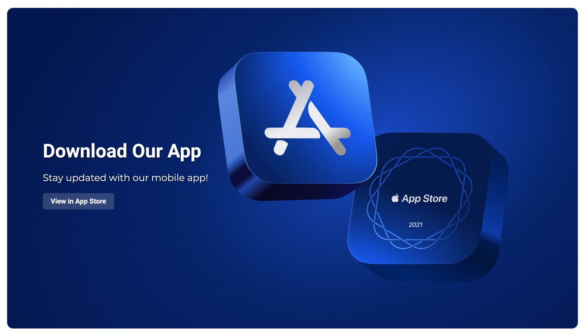

# Day #96 - Vue & Typescript Mobile App Download Card

## Preview



This project showcases a Vue.js component named `MobileAppCard` that displays a mobile application promotional card with a background image, app title, description, and a button linking to the app store.

## Project setup
To set up the project environment, after cloning or downloading the project, you can install the necessary dependencies by running:
```
yarn install
```
This command fetches all the dependencies defined in `package.json` and installs them in your project's `node_modules` directory.

### Compiles and hot-reloads for development
To start a development server with hot-reload enabled, which is very useful for developing without needing to manually refresh your browser after making changes, run:

### Compiles and hot-reloads for development
```
yarn serve
```

This will start a local development server. By default, the application will be available at [http://localhost:8080](http://localhost:8080). The development server will watch for any changes in the source files and automatically reload the web page, showing the latest changes immediately.

### Compiles and minifies for production
When you are ready to build a production-ready version of your project, run:
```
yarn build
```
This command compiles all your assets, minifies them, and outputs them to the `dist` directory in your project. This version is optimized for performance, with minified assets and optimized images.

### Customize configuration
For more detailed configuration options specific to Vue.js and your project setup, you can refer to the Vue CLI configuration reference:

[Configuration Reference](https://cli.vuejs.org/config/).

This link provides detailed documentation on configuring various aspects of your Vue.js project, including build options, dev server settings, and more.