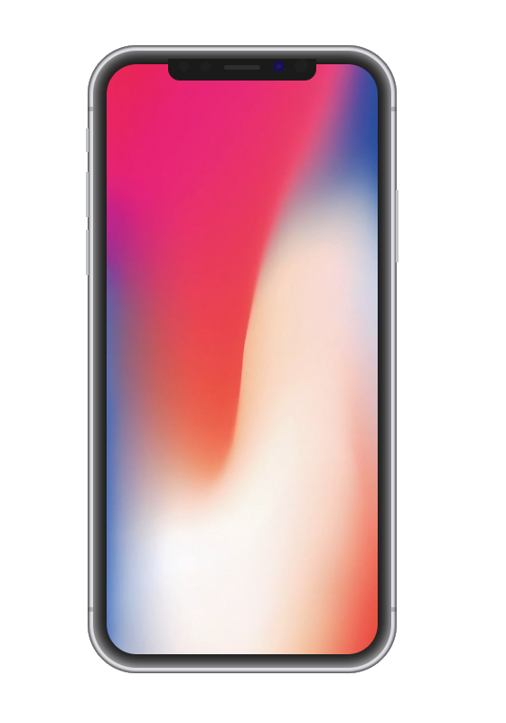

# Day #98 - iPhone Emulator

## Preview

This project is a web application that mimics an iPhone screen and frame using CSS. A video plays automatically and loops on the iPhone screen.

## Table of Contents

- [Features](#features)
- [Usage](#usage)
- [Development](#development)
- [Contributing](#contributing)

## Features

- The iPhone frame and sensors are created with CSS.
- A video automatically plays and loops on the screen.
- The screen, power button, and volume buttons are all designed using CSS.

## Usage

To clone and run this project on your local machine, follow these steps:

1. Clone this repository
2. Navigate to the project directory
3. Open the `index.html` file in a web browser.

## Development

The project structure is as follows:

plaintext
iphone-emulator/
├── index.html
├── style.css
└── main.js

## CSS

- The style.css file styles the iPhone frame, screen, and other visual elements.

## Contributing

If you want to contribute, please create an issue first to discuss what you would like to change. Pull requests are welcome.

1. Fork the repository
2. Create your feature branch (git checkout -b feature/fooBar)
3. Commit your changes (git commit -am 'Add some fooBar')
4. Push to the branch (git push origin feature/fooBar)
5. Create a new Pull Request