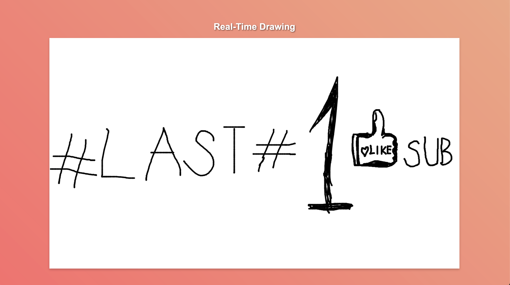

# Day #99 - RealTime Drawing Application with NodeJS

## Preview

This project is a real-time drawing application built with Node.js, Express.js, and Socket.io. Users can draw on a canvas and see the drawings of other users in real-time.

## Table of Contents

- [Features](#features)
- [Prerequisites](#prerequisites)
- [Usage](#usage)
- [Project Structure](#projectstructure)
- [How It Works](#howitworks)
- [Dependencies](#dependencies)
- [License](#license)
- [Contributing](#contributing)

## Features

•   Real-time drawing with multiple users
•	Simple and clean user interface
•	Responsive design

## Prerequisites

•	Node.js (v12 or higher)
•	npm (comes with Node.js)

## Usage

To clone and run this project on your local machine, follow these steps:

1. Clone the repository
2. Install the dependencies:
``
npm install
``
3. Start the server:
``
node index.js
``
4. Open your web browser and go to http://localhost:3000

## Project Structure

The project structure is as follows:

realtime-drawing
├── node_modules
├── public
│   ├── index.html
│   ├── styles.css
│   └── script.js
├── package.json
└── index.js

•	index.js: The main server file.
•	public/index.html: The main HTML file.
•	public/styles.css: The CSS file for styling.
•	public/script.js: The JavaScript file for client-side logic.

## How It Works

•	index.js: Sets up an Express server and Socket.io for real-time communication. Serves static files from the public directory.
•	public/index.html: The main HTML file that includes the canvas and scripts.
•	public/styles.css: Styles for the application.
•	public/script.js: Handles the drawing logic and emits drawing events to the server via Socket.io.

## Dependencies

•	Express: Fast, unopinionated, minimalist web framework for Node.js.
•	Socket.io: Enables real-time, bidirectional and event-based communication.

## License

This project is licensed under the MIT License. See the [LICENSE](LICENSE) file for more details.

## Contributing

If you want to contribute, please create an issue first to discuss what you would like to change. Pull requests are welcome.

1.	Fork the repository.
2.	Create a new branch (git checkout -b feature-branch).
3.	Make your changes.
4.	Commit your changes (git commit -am 'Add new feature').
5.	Push to the branch (git push origin feature-branch).
6.	Create a new Pull Request.